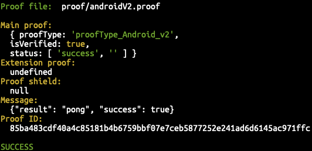
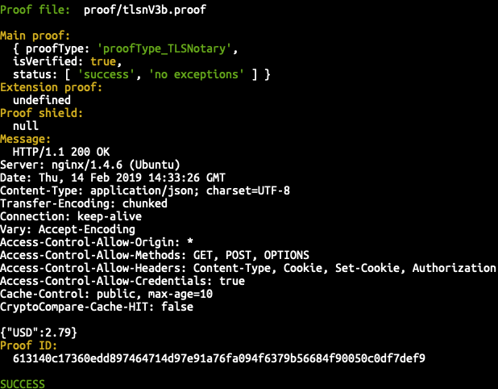
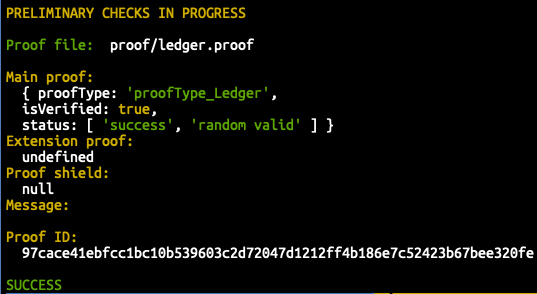

# Oraclize Proof Verification Tool

## Version 0.2.2

The `proof-verification-tool` allows users to _verify if an Oraclize proof is valid_.

It can be used:

__❍__ From the **Command Line**.

It can be embedded:

__❍__ As a Module in a **Node app** (though not yet via `npm`);

__❍__ In the **Browser**, in `j2v8`.

### Functions Exposed

__❍__ `getProofType(proof: string): ProofType`: accepts a _hexadecimal string_ (the proof), and returns a proof type. For now, the proof types supported are:

  * `proofType_TLSNotary`

  * `proofType_Android`

  * `proofType_Ledger`

__❍__ `verifyProof(proof: Uint8Array, ?callback): Promise<ParsedProof>`: accepts a _byte array_ (the proof), an optional callback, and returns a promise containing the following object:

```javascript
    {
      mainProof: {
        proofType: MainProof,
        isVerified: boolean,
        status: VerificationStatus
      },
      extensionProof: ?{
        proofType: ExtensionProof,
        isVerified: boolean,
        status: VerificationStatus
      },
      proofShield: ?{
        proofType: ShieldProof,
        isVerified: boolean,
        status: VerificationStatus },
      message: string | {type: 'hex', value: string},
      proofId: string,
    }
```

Please, note that the char `?`, in the json snippet above, stands for **optional**.

### :black_nib: Notes:

__❍__ The `proofType_Android` has two versions. The user should provide the _configuration parameters_ for v1 and v2 in the config file `./settings/settings.json`. These parameters are provided by the Android device and along with the Google API key, are used to generate and validate the proof. The values provided in settings are just examples of how they are used.

__❍__ All the newly generated `proofType_Android` proofs are **v2**.

## :computer: Use from the Command Line

Please, remember that the target is _ECMA 2015_, but if you want to use `yarn` you should have at least `node 4.2.6`.

For using the Oraclize Proof Verification Tool from the _command line_, execute the following steps:

**1)** Clone the repository:

__`❍ git clone https://github.com/oraclize/proof-verification-tool.git`__

**2)** Install the deps:

__`❍ cd proof-verification-tool && yarn install`__

**3)** Build the project:

__`❍ yarn build`__

### :mag_right: Proof Verification

When you use the `proof-verification-tool` from the command line, you can check if the proof is valid or extract the message contained in the proof:

**a)** Check the proof validity:

__`❍ node ./lib/cli <path/to/proof>`__

  * If the proof is _valid_, the tool prints out the `ParsedProof`, then exits cleanly showing a **SUCCESS** message;

  * If the proof is _not valid_, the tool shows a **FAILURE** message, then exits with a non-zero
      exit code.

**b)** Extract the message contained in the proof:

__`❍ node ./lib/cli <path/to/proof> -s <path/to/output>`__

  * If the proof is _valid_, the tool prints out the `ParsedProof`, then exits cleanly with an exit code 0;

  * If the proof is _not valid_, the tool exits with a non-zero exit code.

If the message contained in the proof is of the type `string`, it will be written to the given output-path as a UTF-8 string; if it is of type `hex`, the data wiil be written as binary.

&nbsp;

## Embed in a Node App

For using the Oraclize Proof Verification Tool from a _Node app_, execute the following steps:

**1)** Clone the repository:

__`❍ git clone https://github.com/oraclize/proof-verification-tool.git`__

**2)** Install the deps:

__`❍ cd proof-verification-tool && yarn install`__

**3)** Build the project:

__`❍ yarn build`__

**4)** Import the module in your app with:

__`❍ import { verifyProof, getProofType } from 'path to proof verification tool directory' + '/lib/index.js\'`__

The target is _ECMA 2015_, but if you want to use yarn you should have at least `node 4.8.0`.

&nbsp;

## Embed in a Java App

For using the Oraclize Proof Verification Tool from a _Java app_, execute the following steps:

**1)** Clone the repository:

__`❍ git clone https://github.com/oraclize/proof-verification-tool.git`__

**2)** Install the deps:

__`❍ cd proof-verification-tool && yarn install`__

**3)** Build the project:

__`❍ yarn build`__

**4)** Create the bundle:

__`❍ yarn browserify-node`__

The target is _ECMA 2015_, but if you want to use yarn you should have at least `node 4.8.0`.

&nbsp;

## Embed in a Browser App

Same as embed in a [Node app](#embed-in-a-node-app)

If you use `browserify`, when you build the bundle, execute:

__`❍ -r fs:browserify-fs`__

&nbsp;

## :camera: Examples of Passing Proofs:





&nbsp;

## :loudspeaker: Support

__❍__ If you have any issues, head on over to our
[Gitter](https://gitter.im/oraclize/ethereum-api?raw=true) channel to get timely support!

__*Happy verification!*__
